  <h1>Heya, I'm Gurmanpreet Singh 👋</h1>
  

  
  

 

## 💫 About Me
- 🔭 I’m currently working on... **My Portfolio Website :D**
- 🌱 I’m currently learning... **JavaScript**
- 👯 I’m looking to collaborate on... **UI/UX designing**
- 💬 Ask me about... **Web Development, UI/UX, or Tech Trends**
- ⚡ Fun fact... **Tomato is actually a fruit!**

 

## 🛠 Languages and Tools

  
  
  
  
  
  

 

## 📊 My GitHub Stats

  

---
