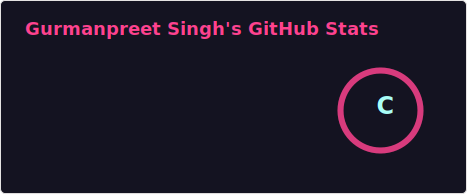

<h1 align="center">Heya, I'm Gurmanpreet Singh 👋</h1>

  

 

  
  

---

## 💫 About Me

*   🔭 I’m currently working on... **a Expense Tracker App 💵**
*   🌱 I’m currently learning... **JavaScript & React**
*   👯 I’m looking to collaborate on... **UI/UX Design & Frontend Projects**
*   💬 Ask me about... **Web Development, UI/UX, or Tech Trends**
*   ⚡ Fun fact... **A tomato is actually a fruit!**

 

## 🛠 Languages and Tools

  
  
  
  
  
  
  

 

## 📊 My GitHub Stats

  

---
